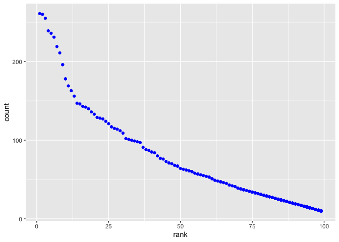

p8105\_hw2\_az2356
================
Amelia Zhao
9/19/2019

# This is my markdown file for Homework 2.

# Problem 1

Setting up the necessary packages.

``` r
library(readxl)
library(tidyverse)
```

    ## ── Attaching packages ────────────────────────────────────── tidyverse 1.2.1 ──

    ## ✔ ggplot2 3.2.1          ✔ purrr   0.3.2     
    ## ✔ tibble  2.1.3          ✔ dplyr   0.8.3     
    ## ✔ tidyr   1.0.0.9000     ✔ stringr 1.4.0     
    ## ✔ readr   1.3.1          ✔ forcats 0.4.0

    ## ── Conflicts ───────────────────────────────────────── tidyverse_conflicts() ──
    ## ✖ dplyr::filter() masks stats::filter()
    ## ✖ dplyr::lag()    masks stats::lag()

Working on the Mr. Trash Wheel data:

  - Creating a relative directory

  - Identifying the Mr. Trash Wheel sheet within the excel file

  - Removing rows without dumpster-specific data (totals) and tidying
    data

<!-- end list -->

``` r
"./data/trashwheel.xlsx"
```

    ## [1] "./data/trashwheel.xlsx"

``` r
trashwheel <- 
  read_excel("data/trashwheel.xlsx", sheet = "Mr. Trash Wheel", range = "A2:N408") %>% 
  janitor::clean_names(dat = .) %>%
  rename(.data = ., volume = volume_cubic_yards, styrofoam = polystyrene, weight = weight_tons) %>%
  drop_na(dumpster)
  mutate(
    trashwheel, sports_balls = as.integer(sports_balls)
    )
```

    ## # A tibble: 344 x 14
    ##    dumpster month  year date                weight volume plastic_bottles
    ##       <dbl> <chr> <dbl> <dttm>               <dbl>  <dbl>           <dbl>
    ##  1        1 May    2014 2014-05-16 00:00:00   4.31     18            1450
    ##  2        2 May    2014 2014-05-16 00:00:00   2.74     13            1120
    ##  3        3 May    2014 2014-05-16 00:00:00   3.45     15            2450
    ##  4        4 May    2014 2014-05-17 00:00:00   3.1      15            2380
    ##  5        5 May    2014 2014-05-17 00:00:00   4.06     18             980
    ##  6        6 May    2014 2014-05-20 00:00:00   2.71     13            1430
    ##  7        7 May    2014 2014-05-21 00:00:00   1.91      8             910
    ##  8        8 May    2014 2014-05-28 00:00:00   3.7      16            3580
    ##  9        9 June   2014 2014-06-05 00:00:00   2.52     14            2400
    ## 10       10 June   2014 2014-06-11 00:00:00   3.76     18            1340
    ## # … with 334 more rows, and 7 more variables: styrofoam <dbl>,
    ## #   cigarette_butts <dbl>, glass_bottles <dbl>, grocery_bags <dbl>,
    ## #   chip_bags <dbl>, sports_balls <int>, homes_powered <dbl>

Working on the 2017 and 2018 Precipitation data:

  - Creating a year variable, omitting rows without precipitation data

  - Combining the 2017 and 2018 data, converting month from a numeric to
    a character variable with the month name

<!-- end list -->

``` r
rain2017 <- 
  read_excel("data/trashwheel.xlsx", sheet = "2017 Precipitation", range = "A2:B14") %>% 
  janitor::clean_names(dat = .) %>% 
  rename(.data = ., inchesrain = total) %>% 
  mutate(year = 2017)


rain2018 <-
  read_excel("data/trashwheel.xlsx", sheet = "2018 Precipitation", range = "A2:B14") %>% 
  janitor::clean_names(dat = .) %>% 
  rename(.data = ., inchesrain = total) %>% 
  mutate(year = 2018)


rain2yr = 
  bind_rows(rain2017, rain2018) %>% 
  mutate(month = month.name[month])
```

Mr. Trash Wheel has been hard at work\! In 5 years (May 2014 to June
2019), Mr. Trash Wheel has collected 1122.45 tons, or 5347 cubic yards,
of trash from the Baltimore Inner Harbor\! That is a ton of trash\!
Mr. Trash Wheel has filled 344 dumpsters\! From the trash collected and
put into Mr. Trash Wheel’s dumpster, the median number of sports balls
was 8 in 2017, and the average number of chip bags was 1780.2732558.
That’s a lot of chips.

From the 24 observations of precipitation data collected, we can see
that there were 70.33 inches of rain in 2018, compared to 32.93 in 2017.
2018 was a wet year\!

# Problem 2

Cleaning the datasets:

  - Standardizing year and month across datasets

  - Creating “president” variable with “gop”, or “dem”

  - Merging the politician, S\&P, and unemployment data
sets

<!-- end list -->

``` r
## Pols data: the number of politicians who are Republican or Democrat at any given month

"./data/538data/pols-month.csv"
```

    ## [1] "./data/538data/pols-month.csv"

``` r
polsmonth = 
  read_csv("data/538data/pols-month.csv") %>% 
  separate(data = ., mon, c("year", "month", "day"), "-", convert = TRUE) %>% 
  mutate(
    month = month.name[month],
    president = case_when(
      prez_gop == 1 ~ "gop",
      prez_dem == 1 ~ "dem"
      )
    ) %>% 
  arrange(year) %>% 
  select(-prez_dem, -prez_gop, -day)
```

    ## Parsed with column specification:
    ## cols(
    ##   mon = col_date(format = ""),
    ##   prez_gop = col_double(),
    ##   gov_gop = col_double(),
    ##   sen_gop = col_double(),
    ##   rep_gop = col_double(),
    ##   prez_dem = col_double(),
    ##   gov_dem = col_double(),
    ##   sen_dem = col_double(),
    ##   rep_dem = col_double()
    ## )

``` r
## S & P stock index: closing values at the beginning of each month

"./data/538data/snp.csv"
```

    ## [1] "./data/538data/snp.csv"

``` r
snp =
  read_csv("data/538data/snp.csv") %>% 
  separate(data = ., date, c("month", "day", "year"), "/", convert = TRUE) %>% 
  select(-day) %>% 
  arrange(month) %>% 
  arrange(year) %>% 
  mutate(
    month = month.name[month],
    ) %>% 
  select(year, month, everything()) 
```

    ## Parsed with column specification:
    ## cols(
    ##   date = col_character(),
    ##   close = col_double()
    ## )

``` r
## Unemployment data: unemployment percentage in each month of each year
  
"./data/538data/unemployment.csv"
```

    ## [1] "./data/538data/unemployment.csv"

``` r
unemploy <-  
  read_csv("data/538data/unemployment.csv") %>% 
  janitor::clean_names(dat = .) %>% 
  pivot_longer(
    data =, 
    jan:dec,
    names_to = "month",
    values_to = "percent"
  )
```

    ## Parsed with column specification:
    ## cols(
    ##   Year = col_double(),
    ##   Jan = col_double(),
    ##   Feb = col_double(),
    ##   Mar = col_double(),
    ##   Apr = col_double(),
    ##   May = col_double(),
    ##   Jun = col_double(),
    ##   Jul = col_double(),
    ##   Aug = col_double(),
    ##   Sep = col_double(),
    ##   Oct = col_double(),
    ##   Nov = col_double(),
    ##   Dec = col_double()
    ## )

``` r
## Merging the datasets
snppols = 
  left_join(polsmonth, snp)
```

    ## Joining, by = c("year", "month")

``` r
alldata = 
  left_join(snppols, unemploy)
```

    ## Joining, by = c("year", "month")

The final dataset is an aggregate of the 3 datasets all about America:
the polsmonth dataset, which contained information about politicians and
their party affiliation at each month, the snp dataset, which contained
information about the Standard & Poor closing index each month, and the
unemployment dataset, which contained the percentage of unemployment
each month.

All of the observations were kept. However, S\&P is missing for many
timepoints, as this dataset was the smallest, with only 787 months of
data from 1950 to 2015, compared to the politician data, which had 822
months of data, from 1947 to 2015. Thus, the resulting dataset contains
822 months of data, with comprehensive data for the politicians, and
missing unemployment and S\&P data for some months.

# Problem 3

``` r
## Baby names data: popularity of baby names.
"./data/babynames.csv"
```

    ## [1] "./data/babynames.csv"

``` r
babynames <- 
  read_csv("data/babynames.csv") %>% 
  janitor::clean_names(dat = .) %>%
  rename(.data = ., name = childs_first_name) %>%
  distinct(.data = .) %>% 
  arrange(year_of_birth) %>% 
  mutate(
    ethnicity = case_when(
      ethnicity == "ASIAN AND PACI" ~ "Asian and Pacific Islander",
      ethnicity == "ASIAN AND PACIFIC ISLANDER" ~ "Asian and Pacific Islander",
      ethnicity == "BLACK NON HISP" ~ "Black Non Hispanic",
      ethnicity == "BLACK NON HISPANIC" ~ "Black Non Hispanic",
      ethnicity == "HISPANIC" ~ "Hispanic",
      ethnicity == "WHITE NON HISP" ~ "White Non Hispanic",
      ethnicity == "WHITE NON HISPANIC" ~ "White Non Hispanic"
      ),
    gender = str_to_title(gender),
    name = str_to_title(name)
  ) 
```

    ## Parsed with column specification:
    ## cols(
    ##   `Year of Birth` = col_double(),
    ##   Gender = col_character(),
    ##   Ethnicity = col_character(),
    ##   `Child's First Name` = col_character(),
    ##   Count = col_double(),
    ##   Rank = col_double()
    ## )

``` r
babynames %>% 
filter(name == "Olivia") %>%
  select(-count, -gender) %>%
  pivot_wider(names_from = year_of_birth,
              values_from = rank)
```

    ## # A tibble: 4 x 8
    ##   ethnicity                 name  `2011` `2012` `2013` `2014` `2015` `2016`
    ##   <chr>                     <chr>  <dbl>  <dbl>  <dbl>  <dbl>  <dbl>  <dbl>
    ## 1 Asian and Pacific Island… Oliv…      4      3      3      1      1      1
    ## 2 Black Non Hispanic        Oliv…     10      8      6      8      4      8
    ## 3 Hispanic                  Oliv…     18     22     22     16     16     13
    ## 4 White Non Hispanic        Oliv…      2      4      1      1      1      1

``` r
babynames %>%
filter(gender == "Male", rank == 1) %>%
  select(-count) %>%
  pivot_wider(names_from = year_of_birth,
              values_from = rank)
```

    ## # A tibble: 11 x 9
    ##    gender ethnicity         name  `2011` `2012` `2013` `2014` `2015` `2016`
    ##    <chr>  <chr>             <chr>  <dbl>  <dbl>  <dbl>  <dbl>  <dbl>  <dbl>
    ##  1 Male   Asian and Pacifi… Ethan      1     NA     NA     NA     NA      1
    ##  2 Male   Black Non Hispan… Jayd…      1      1     NA     NA     NA     NA
    ##  3 Male   Hispanic          Jayd…      1      1      1     NA     NA     NA
    ##  4 Male   White Non Hispan… Mich…      1     NA     NA     NA     NA     NA
    ##  5 Male   Asian and Pacifi… Ryan      NA      1     NA     NA     NA     NA
    ##  6 Male   White Non Hispan… Jose…     NA      1     NA      1     NA      1
    ##  7 Male   Asian and Pacifi… Jayd…     NA     NA      1      1      1     NA
    ##  8 Male   Black Non Hispan… Ethan     NA     NA      1      1     NA     NA
    ##  9 Male   White Non Hispan… David     NA     NA      1     NA      1     NA
    ## 10 Male   Hispanic          Liam      NA     NA     NA      1      1      1
    ## 11 Male   Black Non Hispan… Noah      NA     NA     NA     NA      1      1

``` r
nameplot = filter(babynames, gender == "Male", ethnicity == "White Non Hispanic", year_of_birth == "2016")
ggplot(nameplot, aes(x = rank, y = count)) + geom_point(colour = "blue") 
```

<!-- -->
